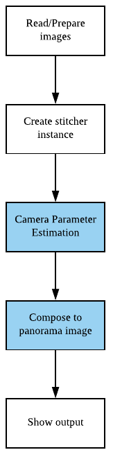

# Estimation and compose

Before see this document and example, Please see  
[Simply call stitch](../simply_call_stitch/simply_call_stitch.md)

## What is difference?

In previouse example simply_call_stitch. just call stitch method of Stitcher

```cpp
Stitcher::Status status = stitcher->stitch(imgs, output);
```

Actually, there are many way to call stitcher's API to stitch.  
One way is call estimateTransform and composePanorama.

```cpp
Stitcher::Status status = stitcher->estimateTransform(imgs);
///checking error
stitcher->composePanorama(output);
```

So, this steps are just divided from stitch step.



### estimateTransform

estimateTransform contains 
* Feature finding
* Matching features
* Homography or Affine based camera parameter estimation
* Bundle adjustment

### composePanorama

composePanorama contains
* Warping images
* Exposure compensation
* Finding Seam
* Blending

### Why use estimateTransform and composePanorama, not stitch method

To sum up
* __estimateTransform__  
Find camera's parameter(intrinsic, rotation, translation,,,etc)
* __composePanorama__  
Combine images according to camera parameters

If you want to get camera parameter calcualted from stitcher API, do like this
1. Do estimateTransform
2. Get camera parameter
3. Do composePanorama to get result image

Also, OpenCV's Stitcher API provide getter of camera parameter. 
Let's see in the next document
