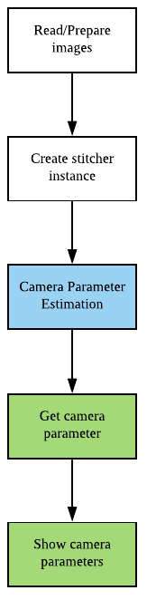

# Get camera parameters

Before see this docs, check below docs

__Detailed Description__ part of
[OpenCV's official docs](https://docs.opencv.org/3.4.2/d9/d0c/group__calib3d.html)

Previous docs  
[Simply call stitch](../simply_call_stitch/simply_call_stitch.md)  
[Estimation and compose](../estimation_and_compose/estimation_and_compose.md)  

## What is difference?

In previous example, 
* calculate camera parameters with estimateTransform
* compose images to panorama image with camera parameter

```cpp
Stitcher::Status status = stitcher->estimateTransform(imgs);
///checking error
stitcher->composePanorama(output);
```

In this example, Let's check how they store camera parameters in structure

```cpp
Stitcher::Status status = stitcher->estimateTransform(imgs);

///checking error

vector<detail::CameraParams> cameras = stitcher->cameras();

for(int i = 0; i < imgs.size(); i++)
{
    DEBUG_PRINT_OUT("----Image index " << i << " camera parameters----");
    DEBUG_PRINT_OUT("Camera intrinsic matrix");
    DEBUG_PRINT_OUT(cameras[i].K());

    DEBUG_PRINT_OUT("Focal length : " << cameras[i].focal);

    DEBUG_PRINT_OUT("Aspect ratio : " << cameras[i].aspect);

    DEBUG_PRINT_OUT("Principle Point X : " << cameras[i].ppx);

    DEBUG_PRINT_OUT("Principle Point Y : " << cameras[i].ppy);

    DEBUG_PRINT_OUT("Rotation matrix");
    DEBUG_PRINT_OUT(cameras[i].R);

    DEBUG_PRINT_OUT("Translation matrix");
    DEBUG_PRINT_OUT(cameras[i].t);
    DEBUG_PRINT_OUT(" ");
}
```



## What is CameraParams?
Call cameras getter from Stitcher API, You can get camera parameters
```cpp
vector<detail::CameraParams> cameras = stitcher->cameras();
```

Definition of this structure is in OpenCV's stitcher moduls's detail  
"include/opencv2/stitching/detail/camera.hpp"

```cpp
struct CV_EXPORTS CameraParams
{
    CameraParams();
    CameraParams(const CameraParams& other);
    const CameraParams& operator =(const CameraParams& other);
    Mat K() const;

    double focal; // Focal length
    double aspect; // Aspect ratio
    double ppx; // Principal point X
    double ppy; // Principal point Y
    Mat R; // Rotation
    Mat t; // Translation
};
```
* __K matrix__  
camera's intrinsic matrix, include Focal length and Principle point
* __focal__  
Focal length
* __aspect__  
Scale factor
* __ppx and ppy__  
Principle point
* __R matrix__  
Rotation matrix
* __t matrix__  
Translation matrix

With these informations, You can do another work that camera parmameter related.

## Result print out

With this repo's sample images

```
----Image index 0 camera parameters----
Camera intrinsic matrix
[709.650348798485, 0, 447;
 0, 709.650348798485, 335.5;
 0, 0, 1]
Focal length : 709.65
Aspect ratio : 1
Principle Point X : 447
Principle Point Y : 335.5
Rotation matrix
[0.93108684, 0.035384167, -0.36307758;
 0.0001988858, 0.99523526, 0.097501867;
 0.36479765, -0.090854913, 0.92664331]
Translation matrix
[0;
 0;
 0]
 
----Image index 1 camera parameters----
Camera intrinsic matrix
[719.9602633448541, 0, 447;
 0, 719.9602633448541, 335.5;
 0, 0, 1]
Focal length : 719.96
Aspect ratio : 1
Principle Point X : 447
Principle Point Y : 335.5
Rotation matrix
[0.99949676, 0.0036283, -0.031512056;
 -0.00032901776, 0.99456888, 0.10407893;
 0.031718541, -0.10401618, 0.99406964]
Translation matrix
[0;
 0;
 0]
 
----Image index 2 camera parameters----
Camera intrinsic matrix
[743.4787164662755, 0, 447;
 0, 743.4787164662755, 335.5;
 0, 0, 1]
Focal length : 743.479
Aspect ratio : 1
Principle Point X : 447
Principle Point Y : 335.5
Rotation matrix
[0.91788989, -0.042156182, 0.39458963;
 0.00015651435, 0.99437976, 0.10587097;
 -0.39683512, -0.09711612, 0.91273779]
Translation matrix
[0;
 0;
 0]

```
