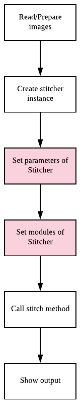
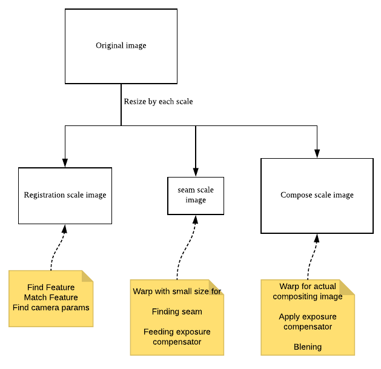

# Setup Parameter and module of OpenCV's stitcher

Before read this docs, this docs from another guys can help you  
[Basic Stitching Pipeline](https://sites.google.com/site/ritpanoramaapp/project-stage-iii)

and, Please see previous docs  
[Simply call stitch](../simply_call_stitch/simply_call_stitch.md)  
[Estimation and compose](../estimation_and_compose/estimation_and_compose.md)  
[Get camera parameters](../get_camera_params/get_camera_params.md)  

## What is difference?

The purpose of this docs is for setting up custom stitcher
So, in this example, We try to apply setup method of stitcher



## How to setup 

```cpp
Mat output;
Ptr<Stitcher> stitcher = Stitcher::create(Stitcher::PANORAMA, try_gpu);

stitcher->setRegistrationResol(0.5);
stitcher->setSeamEstimationResol(0.1);
stitcher->setCompositingResol(Stitcher::ORIG_RESOL);
stitcher->setPanoConfidenceThresh(1.0);
stitcher->setWaveCorrection(true);
stitcher->setWaveCorrectKind(detail::WAVE_CORRECT_HORIZ);

stitcher->setFeaturesFinder(makePtr<detail::OrbFeaturesFinder>());
stitcher->setFeaturesMatcher(makePtr<detail::BestOf2NearestMatcher>(try_gpu));
stitcher->setBundleAdjuster(makePtr<detail::BundleAdjusterRay>());
stitcher->setWarper(makePtr<SphericalWarper>());
stitcher->setExposureCompensator(makePtr<detail::BlocksGainCompensator>());
stitcher->setSeamFinder(makePtr<detail::VoronoiSeamFinder>());
stitcher->setBlender(makePtr<detail::MultiBandBlender>());

Stitcher::Status status = stitcher->stitch(imgs, output);
```

Stitcher API's parameter and module setup methods start with 'set'

### Parameter setup
* __setRegistrationResol__  
For speed up, resize images. argument is ratio of resized image  
ex) 0.5 means image will resized to half of area of original size
* __setSeamEstimationResol__  
For speed up, resize images for Seam finder. argument is ratio of resized image  
ex) 0.1 means image will resized to 10 percent of area of original size
* __setCompositingResol__  
For speed up, resize images when compose panorama. argument is ratio of resized image  
ex) ORIG_RESOL means images will not be resized
* __setPanoConfidenceThresh__  
Threshold for bundle adjustment module
* __setWaveCorrection__  
Do wave correction or not, for preventing wavy effect of panorama image
* __setWaveCorrectKind__  
Type of wave correction

### Module setup
* __setFeaturesFinder__  
Set module to find feature point and calculate descriptor of feature
* __setFeaturesMatcher__  
Set module to match found features
* __setBundleAdjuster__  
Set module to bundle adjustment
* __setWarper__  
Set module to warp images according to found camera parameter
* __setExposureCompensator__  
Set module to compensate exposure
* __setSeamFinder__  
Set module to find seam from warped images
* __setBlender__  
Set module to blend warped and seam found images

# Why resize image?

Some modules like Seam finder and Exposure compensator takes too much time if work with original image
So, They resize images for that modules


