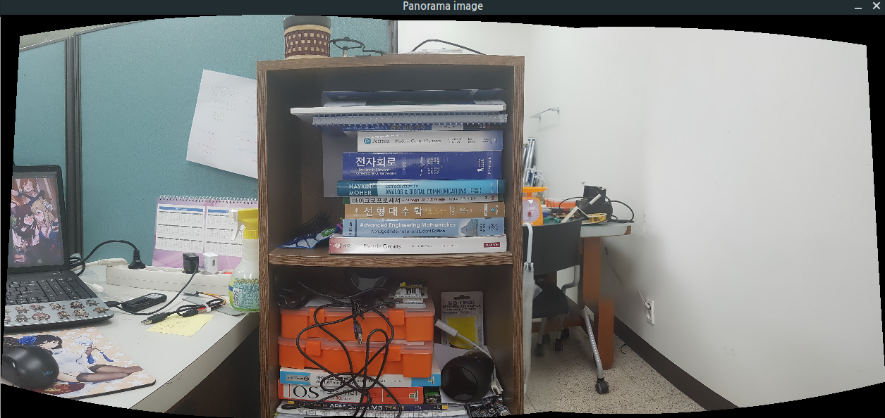

# Simply call stitch

This example shows easiest way of OpenCV's stitcher  
Just call stitch method  


## Include, definition 

```cpp
#include "opencv2/imgcodecs.hpp"
#include "opencv2/highgui.hpp"
#include "opencv2/stitching.hpp"

#include <iostream>
```

* imgcodecs module is for reading and decoding images 
* highgui module is for showing output images with imshow
* stitching module is API for image stitching, contains part of stitching. 

```cpp
#ifdef DEBUG_PRINT
#define DEBUG_PRINT_ERR(x) (std::cerr << x << std::endl)
#define DEBUG_PRINT_OUT(x) (std::cout << x << std::endl)
#else
#define DEBUG_PRINT_ERR(x)
#define DEBUG_PRINT_OUT(x)
#endif

using namespace std;
using namespace cv;

bool try_gpu = false;
float imshow_scale_factor = 0.2f;
```

* DEBUG_PRINT is print wraper for debug
* This example use C++'s STL and OpenCV, for convenience, list namespaces in advance.
* OpenCV has useful option for applying GPU acceleration with CUDA, try_use is for it
* If your sample images is too big, just set imshow_scale_factor to resize output image

## In main

### Read/Prepare images to stitch
```cpp
    Mat im1 = imread("../sample_image/test_image1.jpg");
    Mat im2 = imread("../sample_image/test_image2.jpg");
    Mat im3 = imread("../sample_image/test_image3.jpg");

    vector<Mat> imgs;
    imgs.push_back(im1);
    imgs.push_back(im2);
    imgs.push_back(im3);
```

* First read images with imread
* OpenCV's stitcher API need std::vector of cv::Mat, prepare it

### Create instance for Stitcher, call stitch method

```cpp
    Mat output;
    Ptr<Stitcher> stitcher = Stitcher::create(Stitcher::PANORAMA, try_gpu);
    Stitcher::Status status = stitcher->stitch(imgs, output);
```

* Prepare output Mat
* Create Stitcher as panorama image, set GPU acceleration option
* call stitch method to stitch

### Checking error, show output image

```cpp
    if (status != Stitcher::OK)
    {
        DEBUG_PRINT_ERR("Fail stitching: ");
        switch(status)
        {
            case Stitcher::ERR_NEED_MORE_IMGS :
                DEBUG_PRINT_ERR("Need more images");
                break;
            case Stitcher::ERR_HOMOGRAPHY_EST_FAIL :
                DEBUG_PRINT_ERR("Homography estimation failed");
                break;
            case Stitcher::ERR_CAMERA_PARAMS_ADJUST_FAIL :
                DEBUG_PRINT_ERR("Camera parameter adjustment failed");
                break;
            default :
                DEBUG_PRINT_ERR("Unknown Error");
        }
    }
    else
    {
        DEBUG_PRINT_OUT("resize output panorama image and show it");
        Mat tmp;
        resize(output, tmp, Size(), imshow_scale_factor, imshow_scale_factor);
        imshow("Panorama image", tmp);
        waitKey(0);
    }
```

* Check status of Stitcher. If error, print out meaning of error
* If there are no error, show output images. If image is too big, resize it according to imshow_scale_factor

## Result

If stitcher API work well, you can see stitched image like below


